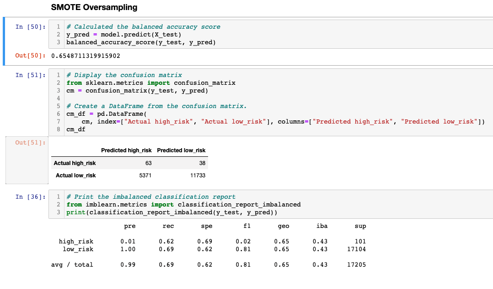

# Credit_Risk_Analysis
## Overview 

For the 17th data analytics project, we were asked to use maching learning models to predict credit risk.  Since we had data with previous outcomes, we opted to supervised machine learning and modeled our data using a few different models (listed below), and  compared the models using Balanced Accuracy Scores, Confusion Matrixes, and Imbalanced Classification Reports

Oversampling 
We used the RandomOverSampler and the SMOTE algorithm.  

Undersampling
We used the ClusterCentroid algorithm.

Over/Under Sampling
We used the SMOTEENN algorithm.

Ensemble models to reduce bias
We used the BalancedRandomForestClassifier and EasyEnsembleClassifier models

## Resources 
- Data Source: [LoanStats_2019Q1.csv](../Resources/LoanStats_2019Q1.csv) 
- Python 3.7.9, Jypyter Notebook 

## Results 
### Balanced Accuracy Scores, Confusion Matrixes, and Imbalanced Classification Reports 

RandomOverSampler Model

The balanced accuracy score is 65.1%  

- High Risk
  - Precision was 1% 
  - Sensitivity was only 74%. 
  - F1 score 2%
- Low Risk
  - 100% Precision
  - 56% Sensitivity
  - F1 score 72%

### SMOTE Model

The results are very similar to the RandomOverSampler model. 
- Balanced Accuracy Score: 65.5% (a fraction higher)

- High Risk
  - Precision was still 1% 
  - Sensitivity was actually a bit lower 62%. 
  - F1 Score 2%

- Low Risk
  - 100% Precision
  - 69% Sensitivity
  - F1 score 81%

### ClusterCentroids Model

- The balanced accuracy score is less at 54.5%  

- High Risk
  - 1% precision 
  - Sensitivity of 69%, 
  - F1 score of 1%. 
- Low Risk
  - 100% precision 
  - Sensitivity of 40%, 
  - F1 score of 57%. 

 

### SMOTEENN Model

- The balanced accuracy score is less at 64.7%  
- High Risk
  - 1% precision 
  - Sensitivity of 72%, 
  - F1 score of 2%. 
- Low Risk
  - 100% precision 
  - Sensitivity of 57%, 
  - F1 score of 72%. 

### BalancedRandomForestClassifier 

- This model brought the balanced accuracy score up to 78.8%
- High Risk
  - 3% precision 
  - Sensitivity of 70%, 
  - F1 score of 6%. 
- Low Risk
  - 100% precision 
  - Sensitivity of 87%, 
  - F1 score of 06%. 

### EasyEnsembleAdaBoostClassifier 

- Our last model brought the balanced accuracy score up to 93.1% 
- High Risk
  - 9% precision 
  - Sensitivity of 92%, 
  - F1 score of 16%. 
- Low Risk
  - 100% precision 
  - Sensitivity of 94%, 
  - F1 score of 97%. 

## Summary
___
All the models we used had a very low precision score for determining if the credit risk is high_risk and high precision for low_risk.  This was greatly attributed to the fact that there were a great deal more low_risk people than there were high_risk. The first 4 models had marginal to bad sensitivities as well, so I wouldn't use them at all.  The last two models were an improvement, still the precision for high_risk was not good even though it was greatly improved from the previous 4 models.  The last model did give very good sensitivity for both low risk and high risk 92% and 94%.  However, the false negatives far outweighed the true positives 10 to 1, meaning the model would still have given loans to 9 out of 10 high risk people.  I do not think that any of these models would be good enough to filter out high risk people for loans.  